....................................
Знакомство с библиотекой librosa
....................................

Каждый аудиосигнал содержит характеристики. Из MFCC (Мел-кепстральных коэффициентов), Spectral Centroid
(Спектрального центроида) и Spectral Rolloff (Спектрального спада) я провел анализ аудиоданных и извлек характеристики
в виде среднего значения, стандартного отклонения и skew (наклон) с помощью библиотеки ``librosa``.
Для классификации аудиоданных я использовал алгоритм машинного обучения - SVM (Support Vector Machines)/машины опорных
векторов. SVM работает путем сопоставления данных с многомерным пространством функций, чтобы точки данных
можно было классифицировать, даже если данные не могут быть линейно разделены иным образом.
В работе были применены математические функции, использующие для преобразования (известна как функция ядра) - RBF
(радиальную базисную функцию).

------------------------------------------------------------------------------------------------------------------------

Для начала обработки аудиоданных разберем аспекты по работе с библиотекой ``librosa``:

- `Загрузка аудиофайла`_;

- `Разделение на гармонические и перкуссионные формы волны`_;

- `Извлечение нормализованной энергии цветности`_;

- `Мел-кепстральные коэффициенты (MFCC)`_;

- `Анализ спектрограммы`_;

- `Спектральный центроид (Spectral Centroid)`_;

- `Спектральный контраст (Spectral Contrast)`_;

- `Спектральный спад (Spectral Rolloff)`_;

- `Спектральная ширина (Spectral bandwidth)`_;

- `Скорость пересечения нуля (Zero Crossing Rate)`_

Для анализа аудиоданных необходимо установить библиотеку ``librosa``. В терминале прописываем команду:

``pip install librosa``

__

После установки всех зависимостей можно переходить к импортированию пакетов

.. code-block:: python

    import IPython.display as ipd
    import librosa.display
    import matplotlib.pyplot as plt
    import numpy as np
    import sklearn

-------------------
Загрузка аудиофайла
-------------------

.. code-block:: python

    audio_path = './training/training-a/a0001.wav'
    y, sr = librosa.load(audio_path)
    print(f'Тип y: {type(y)} sr: {type(sr)}')
    print(f'Размер аудиофайла: {y.shape}, Частота дискретизации: {sr}')
    print(f'Переменные: y={y}, sr={sr}')

Используя библиотеку librosa мы подгружаем наш аудиосигнал эхокардиограммы и декодируем его как временной ряд.

- `y` - представляет собой одномерный numpy-массив ``<class 'numpy.ndarray'>``
- `sr` - содержит в себе частоту дискретизации `y`, то есть количество отсчетов звука за одну секунду ``<class 'int'>``.

По дефолту во время загрузки весь звук микшируется в моно и проходит передискретизацию до 22050 Гц.
Рассмотрим вывод нашего кода:

.. code-block:: python

    Тип y: <class 'numpy.ndarray'> sr: <class 'int'>
    Размер аудиофайла: (786436,), Частота дискретизации: 22050
    Переменные: y=[-0.00204706, -0.00228845, -0.00252952, ..., -0.00101112, -0.00060193, 0.0], sr=22050

С помощью утилиты ``IPython.display`` можно проигрывать аудио в `Jupyter Notebook`,
а с помощью и ``display.waveshow()`` из библиотеки ``librosa``.

.. code-block:: python

    plt.figure(figsize=(14, 5))
    librosa.display.waveshow(y, sr=sr)
    ipd.Audio(audio_path)

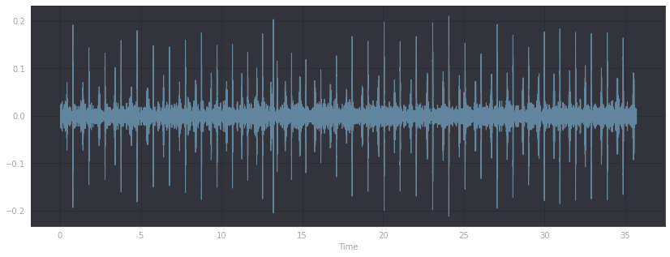

-------------------------------------------------------
Разделение на гармонические и перкуссионные формы волны
-------------------------------------------------------

На текущем этапе мы разделим входной аудиосигнал на дфе формы волны `гармоническую` и `ударную`. При этом исходный
размер (форма и продолжительность) временного ряда сохраняется.

.. code-block:: python

    y_harmonic, y_percussive = librosa.effects.hpss(y)
    plt.figure(figsize=(14, 5))
    librosa.display.waveshow(y_harmonic, sr=sr, alpha=0.25)
    librosa.display.waveshow(y_percussive, sr=sr, color='r', alpha=0.5)
    plt.title('Harmonic + Percussive')

Как мы можем наблюдать, исходный аудиосигнал был разделен на два, которые содержат, соответственно,
гармоническую и перкуссионную части сигнала.

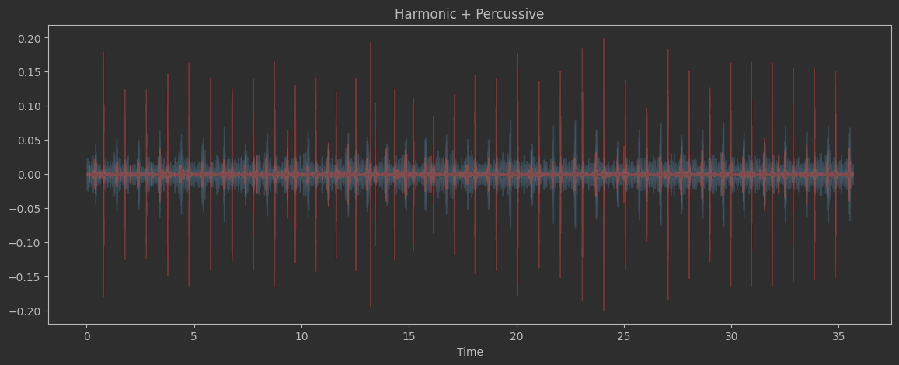

--------------------------------------------
Извлечение нормализованной энергии цветности
--------------------------------------------

`Chroma Energy Normalized (CENS)` или нормализованная энергия цветности основного тона основана на двенадцати атрибутах
написания основного тона в нотной записи. Соответственно, каждый вектор цветности показывает, как энергия в момент
сигнала распределяется по двенадцати полосам цветности. Колебание таких изменений во времени представляет собой
хромограмму, которая, в свою очередь, коррелирует с гармонической и мелодической составляющей аудиосигнала.

Хромограммы часто схожи для различных вариантов записи одного звука с некоторыми помехами. Таким образом,
нормализованная энергия цветности применяется для сопоставления звука, в котором могут допускаться некоторые вариации.

Как пример, несколько исполнений одного и того же музыкального произведения разными людьми может показывать значительные
глобальные и локальные нелинейные различия в темпе, артикуляции и фразировке.

.. code-block:: python

    chroma = librosa.feature.chroma_cens(y=y_harmonic, sr=sr)
    plt.figure(figsize=(15, 5))
    librosa.display.specshow(chroma, y_axis='chroma', x_axis='time')
    plt.colorbar()

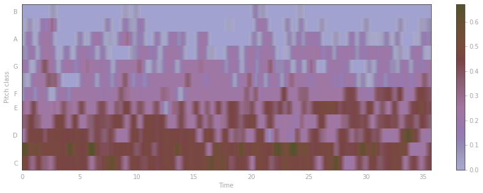

------------------------------------
Мел-кепстральные коэффициенты (MFCC)
------------------------------------

`Мел-кепстральные коэффициенты (MFCC)` являются одними из основных инструментов в обработке аудиофайлов. MFCC
представляют собой матрицу значений, которая отражает тембральные аспекты аудиосигнала и описывает общую форму
спектральной огибающей.
MFCC - коэффициенты частотной капсулы, суммируют частотное распределение по размеру окна. Поэтому можно анализировать
как частотные, так и временные характеристики звука. Перед построением графика коэффициенты нормализуются.

.. code-block:: python

    mfcc = librosa.feature.mfcc(y=y_harmonic, sr=sr, n_mfcc=20)
    plt.figure(figsize=(15, 5))
    librosa.display.specshow(mfcc, x_axis='time')
    plt.colorbar()
    plt.title('MFCC')

Мел-кепстральные коэффициенты (MFCC) в виде массива numpy:

.. code-block:: python

      array([[ -612.0665    -619.62604   -621.37067   ...   -615.0938    -612.46936   -595.72614]
             [  112.0748     107.38798    105.51049   ...  112.157196      115.2572    122.03837]
             [  66.56882      72.43051    71.998856   ...    73.17801     75.092926     61.71958]
             ...
             [   9.509214    10.496708     9.088776   ...   8.135908       8.496203    5.5139575]
             [  11.212017    11.970604    12.332018   ...   8.739999      10.537102     9.607306]
             [   9.782471     9.649057     11.94758   ...   4.923766       7.666393     9.446636]])

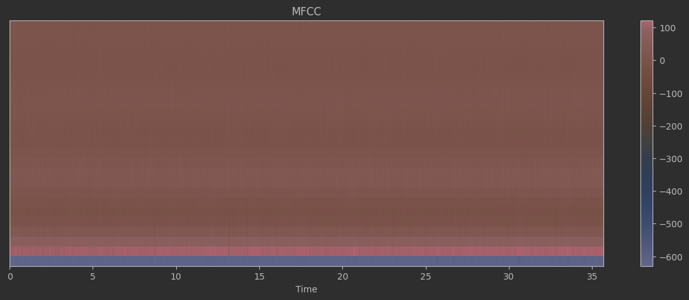

--------------------
Анализ спектрограммы
--------------------

`Спектрограмма` - это способ визуализировать уровни сигнала во времени на определенных частотах, присутствующих в файле.
Обычно изображается в виде тепловой карты. Функция ``librosa.stft()`` преобразует данные в кратковременные
преобразования Фурье. С помощью данной функции так же можно определить амплитуду различных частот, воспроизводимых в
данный момент времени аудиосигнала.

.. code-block:: python

    y_stft = librosa.stft(y)
    y_stft_db = librosa.amplitude_to_db(abs(y_stft))
    plt.figure(figsize=(14, 5))
    librosa.display.specshow(y_stft_db, sr=sr, x_axis='time', y_axis='hz')
    plt.colorbar()

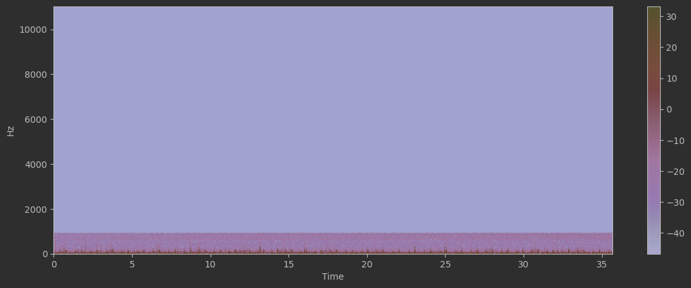

------------------------------------------------------------------------------------------------------------------------

Можем заметить, что практически все значения располагаются в нижней части спектра.
Для этого преобразуем ось частот в логарифмическую.

.. code-block:: python

    y_stft = librosa.stft(y)
    y_stft_db = librosa.amplitude_to_db(abs(y_stft))
    plt.figure(figsize=(14, 5))
    librosa.display.specshow(y_stft_db, sr=sr, x_axis='time', y_axis='log')
    plt.colorbar()

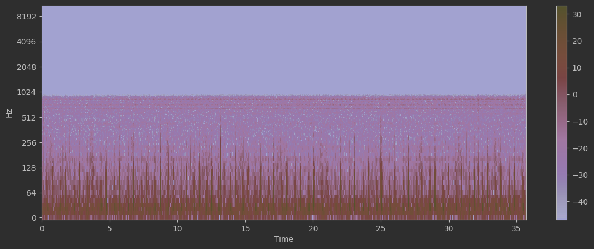

-----------------------------------------
Спектральный центроид (Spectral Centroid)
-----------------------------------------

`Спектральный центроид` указывает, на какой частоте находится основная энергия спектра, то есть, где находится центр
масс аудиофайла. Функция ``librosa.feature.spectral_centroid()`` вычисляет спектральный центроид для каждого фрейма
в сигнале.

.. code-block:: python

    centroid = librosa.feature.spectral_centroid(y=y, sr=sr)
    plt.figure(figsize=(14, 5))
    plt.semilogy(centroid.T, label='Spectral centroid')
    plt.ylabel('Hz')
    plt.legend()

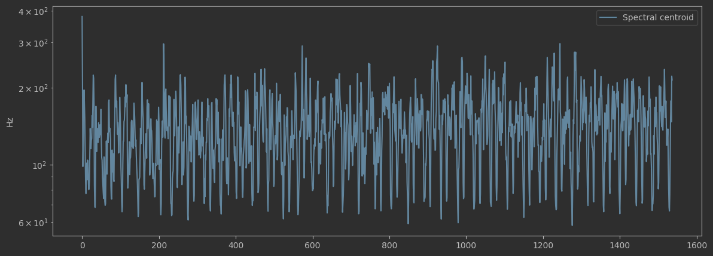

------------------------------------------------------------------------------------------------------------------------

Теперь отобразим спектральный центроид вместе с формой волны

.. code-block:: python

    # Функция для нормализации спектрального центроида
    def normalize(input_array, axis=0):
        return sklearn.preprocessing.minmax_scale(input_array, axis=axis)

    centroid = librosa.feature.spectral_centroid(y=y, sr=sr)[0]
    audio_frames = range(len(centroid))

    split_audio = librosa.frames_to_time(audio_frames)

    plt.figure(figsize=(14, 5))
    librosa.display.waveshow(y, sr=sr, alpha=0.5, label='waveform')
    plt.plot(split_audio, normalize(centroid), color='b', label='Spectral centroid')
    plt.legend()

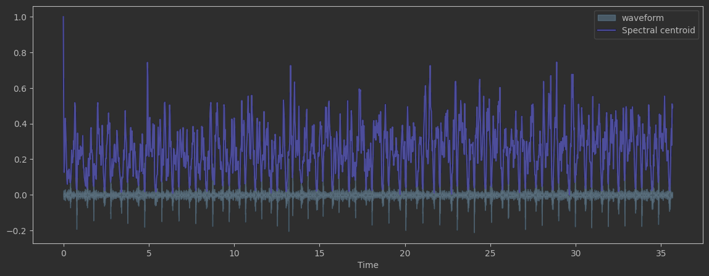

-----------------------------------------
Спектральный контраст (Spectral Contrast)
-----------------------------------------

Каждый фрейм спектрограммы делится на поддиапазоны. В свою очередь, каждый такой поддиапазон оценивается энергетический
контраст путем сравнения средней энергии в верхнем квантиле (энергия пика) со среднем значением энергии в нижнем
квантиле (энергия впадины). Высокие значения контрастности обычно соответствуют четким узкополосными сигналами, а
низкие значения контрастности соответствуют широкополосным шумам.

.. code-block:: python

    contrast = librosa.feature.spectral_contrast(y=y_harmonic, sr=sr)

    plt.figure(figsize=(14, 5))
    librosa.display.specshow(contrast, x_axis='time')
    plt.colorbar()
    plt.ylabel('Диапазоны частот')
    plt.title('Спектральный контраст')

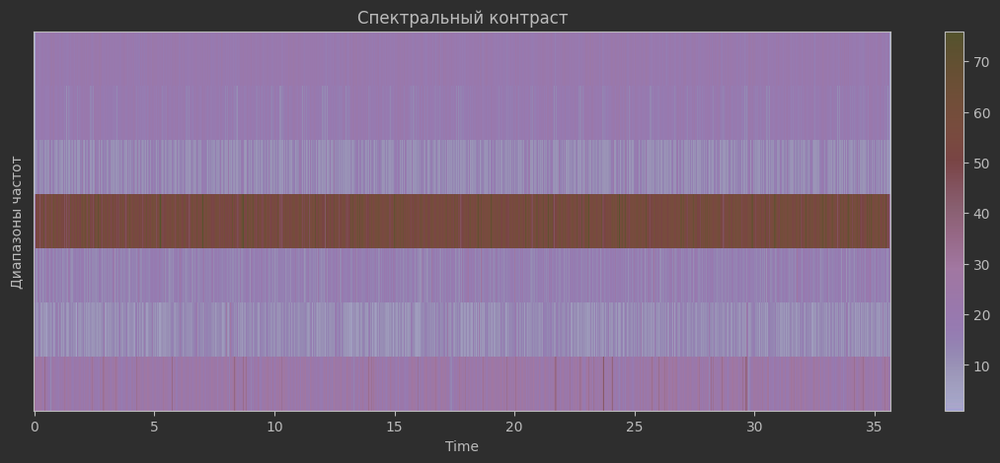

------------------------------------
Спектральный спад (Spectral Rolloff)
------------------------------------

Эта мера формы сигнала, представляющая собой частоту,в которой высокие частоты снижаются до 0. Что бы получить ее, нужно
рассчитать долю элементов в спектре мощности, где 85% ее мощности находится на более низких частотах. Функция
``librosa.feature.spectral_rolloff()`` вычисляет частоту спада для каждого фрейма в сигнале

.. code-block:: python

    rolloff = librosa.feature.spectral_rolloff(y=y, sr=sr)
    plt.figure(figsize=(14, 5))
    plt.semilogy(rolloff.T, label='Roll-off frequency')
    plt.ylabel('Hz')
    plt.legend()

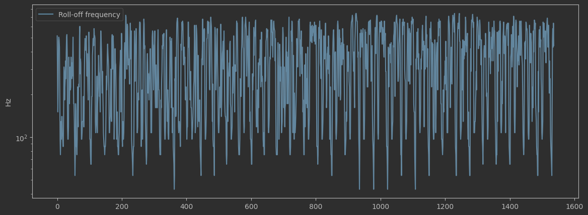

------------------------------------------------------------------------------------------------------------------------

Теперь покажем спектральный спад ете с формой волны

.. code-block:: python

    rolloff = librosa.feature.spectral_rolloff(y=(y + 0.01), sr=sr)[0]
    plt.figure(figsize=(14, 5))
    librosa.display.waveshow(y, sr=sr, alpha=0.5, label='waveform')
    plt.plot(split_audio, normalize(rolloff), color='r', label='Roll-off frequency')
    plt.legend()

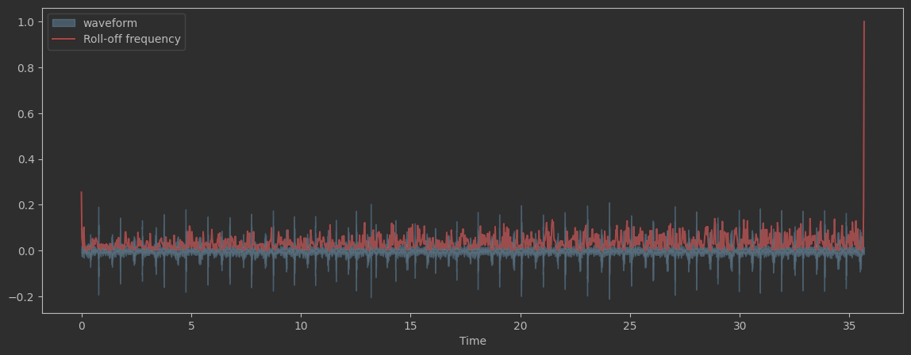

----------------------------------------
Спектральная ширина (Spectral bandwidth)
----------------------------------------

Спектральная ширина определяется как ширина полосы света на половине максимальной точки.
Спектральная полоса пропускания в кадре `frame`. Результат - полоса частот p-го порядка для каждого кадра.

.. code-block:: python

    spectral_bandwidth_2 = librosa.feature.spectral_bandwidth(y=(y + 0.01), sr=sr, p=2)[0]
    spectral_bandwidth_3 = librosa.feature.spectral_bandwidth(y=(y + 0.01), sr=sr, p=3)[0]
    spectral_bandwidth_4 = librosa.feature.spectral_bandwidth(y=(y + 0.01), sr=sr, p=4)[0]
    plt.figure(figsize=(14, 5))
    plt.plot(split_audio, normalize(spectral_bandwidth_2), color='b')
    plt.plot(split_audio, normalize(spectral_bandwidth_3), color='g')
    plt.plot(split_audio, normalize(spectral_bandwidth_4), color='r')
    plt.legend(('p=2', 'p=3', 'p=4'))
    librosa.display.waveshow(y, sr=sr, alpha=0.4)

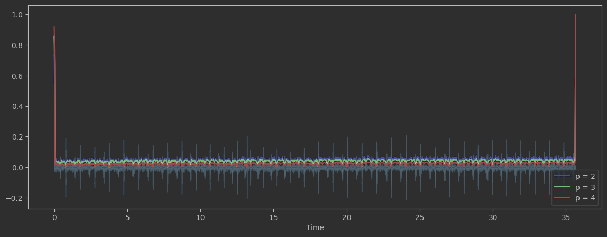

----------------------------------------------
Скорость пересечения нуля (Zero Crossing Rate)
----------------------------------------------

Простой способ измерения гладкости сигнала — вычисление числа пересечений нуля в пределах сегмента этого сигнала.
Голосовой сигнал колеблется медленно. Например, сигнал 100 Гц будет пересекать ноль 100 раз в секунду, тогда как "немой"
фрикативный сигнал может иметь 3000 пересечений нуля в секунду

.. code-block:: python

    zc_rate = librosa.feature.zero_crossing_rate(y_harmonic)
    plt.figure(figsize=(14, 5))
    plt.semilogy(zc_rate.T, label='Fraction')
    plt.ylabel('Fraction per Frame')
    plt.legend()

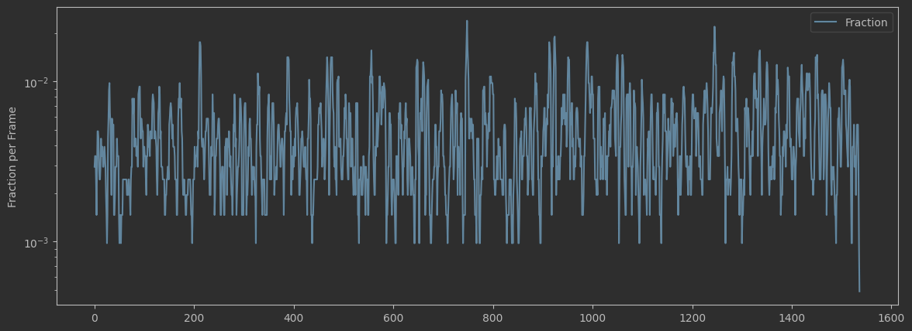

------------------------------------------------------------------------------------------------------------------------

Скорость пересечения нуля - Zero Crossing Rate (увеличенный масштаб)

.. code-block:: python

    # рассматриваются 1000 фреймов аудиофайла (с 11_000 по 12_000)
    n0 = 11_000
    n1 = 12_000
    plt.figure(figsize=(14, 5))
    plt.plot(y[n0:n1])
    plt.grid()

    # вычислим количество пересечений на заданном интервале
    zero_crossings = librosa.zero_crossings(y[n0:n1], pad=False)
    print(sum(zero_crossings)) # -> 4

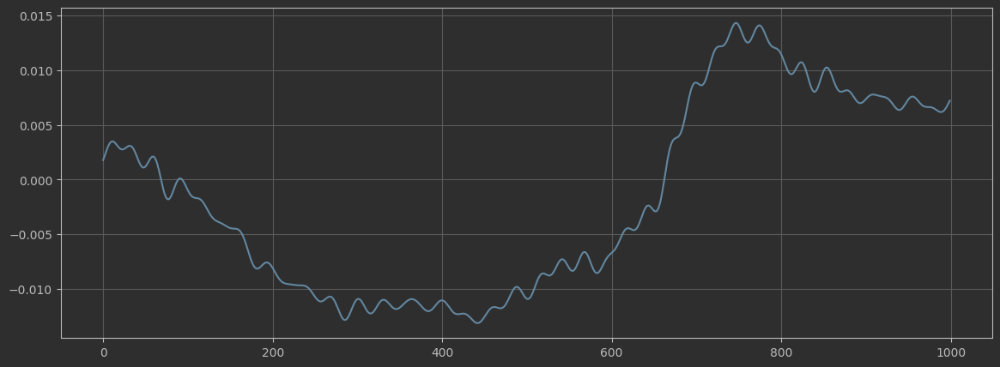

